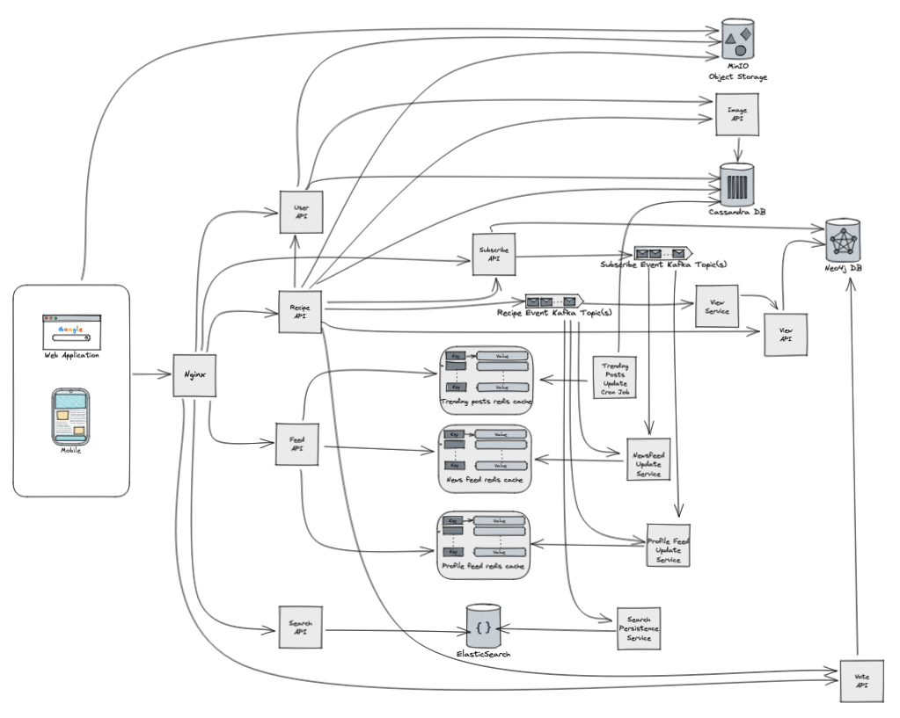

# kodawari

Kodawari implements the backend for a mock social media platform geared towards chefs and home cooks who enjoy managing and iterating on their recipes.
## Table of Contents
* [Features](#features)
* [High Level Design (self-hosted)](#high-level-design-(self-hosted))
* [Technologies](#technologies)
## Features
* Post a recipe template and variations of a recipe
* Like/Dislike recipes and variations
* Subscribe to users and recipes
* Retrieve a subscription feed, trending posts feed, or user feed
* Search for users, recipes, and variations
## High Level Design (self-hosted)

#### Technologies
___
Despite being a mock social media platform, we want to build kodawari with highly performant and scalable technologies that would allow us to scale to millions of daily active users with limited back-end changes. However, we are unwilling to invest in AWS solutions at this time and will be self-hosting all of our services.
#### MinIO
We use [MinIO](https://min.io/docs/minio/container/index.html) object storage, as a self-hosted solution in place of [Amazon S3](https://aws.amazon.com/s3/) for storing user, recipe, and variation images.
#### Cassandra
Recipes, Variations, User data, and Image meta-data is stored in [Cassandra](https://cassandra.apache.org/doc/latest/), as a self-hosted solution in place of [DynamoDB](https://aws.amazon.com/dynamodb/). Cassandra was chosen for storing this data for it's performance and horizontal-scalability. We can structure our data to leverage direct key lookups, making a [wide-column store](https://en.wikipedia.org/wiki/Wide-column_store) optimal for many of our data access patterns.
#### Neo4j
A graph database is leveraged to model complex relationships between users, recipes, and variations. This allows us to simplify storage of likes/dislikes, subscriptions, and views. It will also allow us to efficiently implement personalized user and recipe recommendations in the future. [Neo4j](https://neo4j.com/docs/getting-started/current/) was chosen for our graph database because of it's large community of users, horizontal-scalability, and robust toolset.
#### Redis
A highly performant distributed cache is vital to our implementation of news feeds. [Redis](https://developer.redis.com/) offers sub-millisecond response times, numerous built in data structures, and impressive scalability.
#### Kafka
Event streaming allows us to decouple our services, simplify our data-flows, and process hefty amounts of data in real-time. [Kafka](https://kafka.apache.org/documentation/) is the industry leading event streaming technology leveraged by tens of thousands of companies. It offers the performance and scalability required for a social media platform of any size.
#### Elasticsearch
A full-text search engine is required for us to implement search functionality for users and recipes. Studies have shown that users notice search-engine suggestion delays above 100ms so a performant full-text search engine is highly desirable for offering search recommendations. [Elasticsearch](https://www.elastic.co/guide/index.html) provides near real-time search functionality that allows us to offer these search recommendations in <100ms speed.
#### Nginx
A reverse-proxy and load balancer is required to sit between our users and our APIs. [Nginx](https://nginx.org/en/docs/) offers a stable, self-hosted, and time-proven solution.
